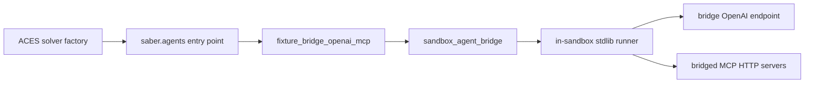

# ACES Adapter Contract Fixtures

This repository is a small external package that validates the **ACES External Bridge Adapter Contract** with real adapters and focused tests. It is intentionally narrower than a generic plugin playground.

## Contract invariants

These fixtures are designed around the same hard constraints the ACES PR now makes explicit:

- sample-scoped lifecycle
- Inspect-visible execution and failure reporting
- sandbox-local benchmark interaction
- native ACES / Inspect control semantics for limits and errors

## What this repo proves

- external adapters can be registered through `saber.agents` entry points
- a prompt-only adapter can opt out of ACES-resolved tools via `supports_tools=False`
- a bridge-managed adapter can run inside the sandbox with `sandbox_agent_bridge()` and keep model / tool / error traffic Inspect-visible

## Included fixtures

- `fixture_briefing` — prompt-only external adapter
- `fixture_bridge_openai_mcp` — bridge-managed external adapter with a custom in-sandbox runner

## What this repo does not pretend to prove

- host-side runtime loops are supported
- opaque wrappers around built-ins validate extensibility
- plugin-owned preflight, limit, or cancellation protocols are part of the contract

## Architecture



## Local development

This repo is meant to live next to an ACES checkout.

```bash
cd /home/rysweet/src
gh repo clone microsoft/ACES aces
gh repo clone rysweet/aces-adapter-contract-fixtures
cd aces-adapter-contract-fixtures
uv sync
uv run ruff check .
uv run pytest
```

The test configuration adds `../aces/src` to `PYTHONPATH` so the fixtures can import `saber.*` from a sibling ACES checkout without pretending that `saber` is a standalone PyPI dependency.

## Installing into an ACES environment

```bash
cd /home/rysweet/src/aces
uv pip install -e ../aces-adapter-contract-fixtures --python .venv/bin/python
```

After that, ACES should be able to resolve these entry points:

- `fixture_briefing`
- `fixture_bridge_openai_mcp`

## Design notes

The bridge fixture intentionally uses a custom in-sandbox runner instead of re-exporting ACES's built-in Copilot or Claude integrations. The point is to validate the contract honestly from an **external** package, not to disguise a built-in under a new entry point.

The bridge fixture also **does not salvage partial bridge state on runner failure**. If the in-sandbox runner exits non-zero, the fixture raises and lets ACES / Inspect account for the sample error directly.

## Current boundary

The custom runner currently supports MCP HTTP endpoints that return JSON responses. It does **not** claim full support for SSE-only response flows. That boundary is intentional and documented so the fixture does not overstate what it validates.
